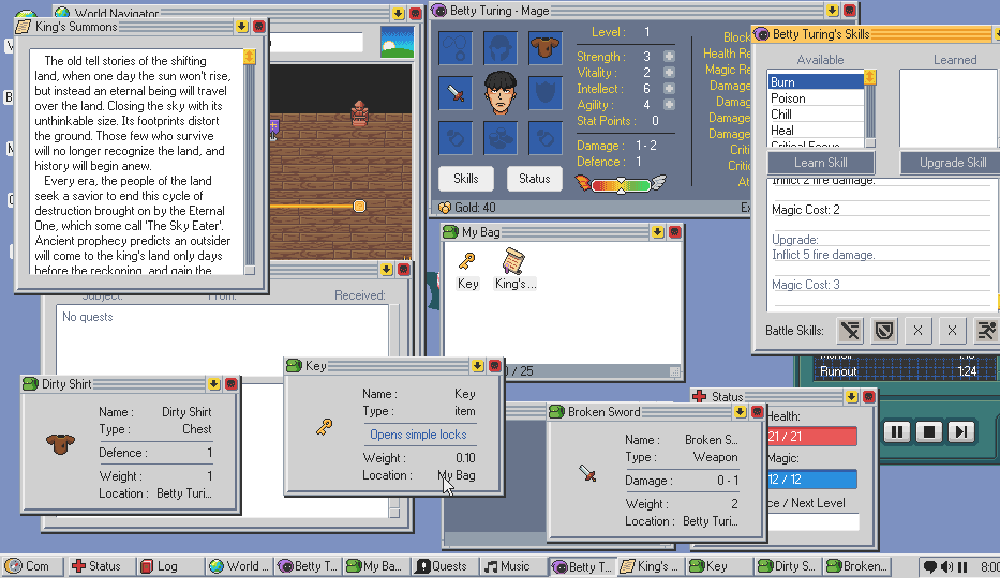
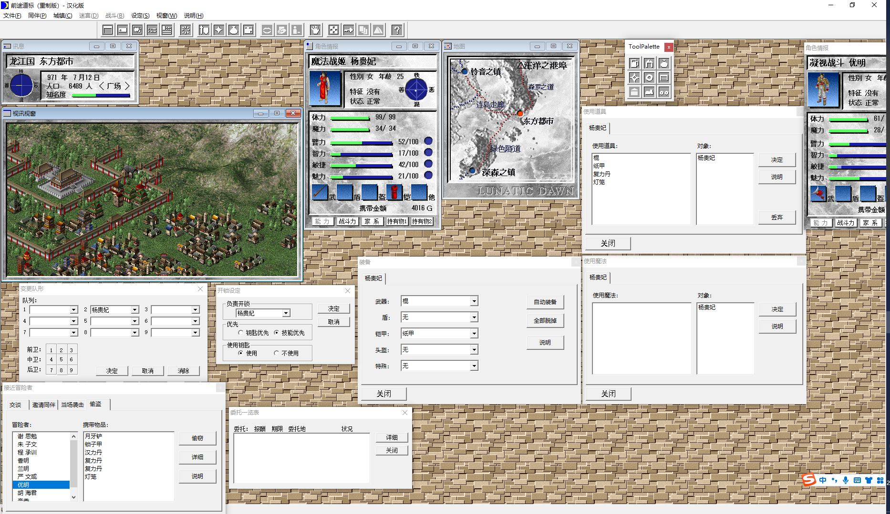

# 掌门人
## 游戏类型
- 放置类
- 挂机
## 游戏引擎
- godot
## 游戏平台
- windows、linux、mac
## 游戏模式
- 单人
- 多人，玩家的角色可以由服务器随机投放到其他玩家的世界，扮演其中的散修，特殊的散修互动，可以互相增加悟道经验。
## 游戏画面
- 2D
- 参考《kings way》、《侠客游》

## 游戏音效
- 有
## 游戏操作
- 鼠标
## 游戏流程
1. 选择角色
2. 选择门派
3. 选择功法
4. 选择神通
5. 选择法宝
## 游戏背景
- 《炼器掌门人》是由ttwings独立开发的放置类游戏。玩家扮演一个炼器师，通过炼器来获得资源，来提升自己的实力，最终成为炼器界的掌门人。
## 游戏玩法
- 玩家通过采集、炼制法宝、丹药、完成委托、交易等来获得资源，提升自己的门派实力，最终借助门派和自身能力，飞升。
## 游戏特色
- 采集、炼制法宝、丹药、完成委托、交易等
- 门派、功法、神通、法宝、丹药、委托、交易等
## 游戏亮点
- 通过炼制方程式，可以炼制出各种法宝、丹药
- 法宝、丹药可以用来参悟神通
- 人物可以通过参悟神通来提升自己的实力
## 游戏难点
- 炼制方程式的设计
- 炼制方程式的实现
- 炼制方程式的优化
- 炼制方程式的扩展
- 炼制方程式的可视化
- 炼制方程式的可交互
- 炼制方程式的可分享
- 炼制方程式的可修改
- 炼制方程式的可导入
- 炼制方程式的可导出

## 游戏难度
- 简单
- 普通
- 困难